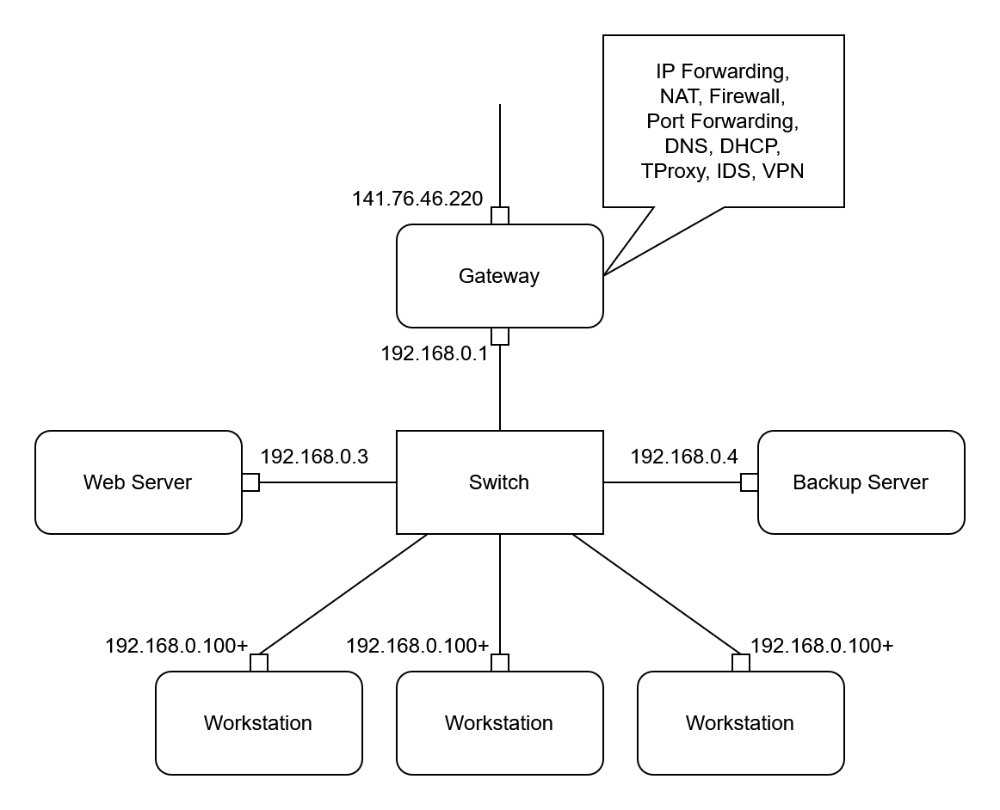

# Network Security Lab

We have **6 computers** in the lab but only two public IPv4 addresses, which requires **NAT** to ensure internet connectivity for all machines. Additionally, **DHCP** is used to simplify network configuration.

The lab provides two public IPv4 addresses with their corresponding domain names, but according to the lab requirements, we only need to use one of them. We select **141.76.46.220** and **netseclab1.inf.tu-dresden.de**.

Since the mask and gateway for the public IP are already determined, we only need to configure a static setup for the WAN.

## Tasks

In addition to the basic network configurations described above, we are also required to complete the following tasks according to the lab requirements:

- Recursive DNS server for internal network use
- Web server accessible from the public network
- Transparent web proxy
- Intrusion detection system
- VPN server
- Automated web server backup

Since all of these tasks require active network connections, the gateway's network configuration must be completed first, followed by the deployment of DHCP and DNS servers, before proceeding to the other tasks.

## Service Table

Some services require static IP addresses, some must be deployed on the gateway.

The internal IP range from **.100** onwards is designated for dynamic DHCP allocation (for workstations), with the other addresses reserved for static allocation.

The table below shows the mapping between the IP addresses and their corresponding services.

| IP Address     | Services                                                                   |
| -------------- | -------------------------------------------------------------------------- |
| 192.168.0.1    | IP Forwarding, NAT, Firewall, Port Forwarding, DNS, DHCP, TProxy, IDS, VPN |
| 192.168.0.3    | Web Server                                                                 |
| 192.168.0.4    | Backup Server                                                              |
| 192.168.0.100+ | Workstation                                                                |

## Network Topology

Our network topology is shown below.

